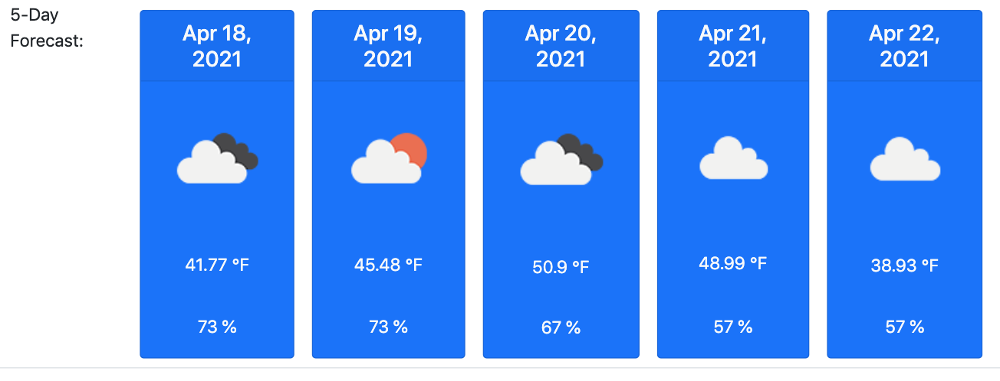

# Weather-Dashboard

Link to live website: (https://https://abalcs.github.io/Day-Planner/)

## Instructions
Use the search function for any city in the world and get the current local forecast along with the 5-day forecast for that city.  

## Purpose
To provide the user with access to real time and future weather data so that they are prepared for any environment as they step outside for the first time since COVID.  

## Directions
Enter the city in the search bar, hit search, viola!  Instant weather information.    

## Issues
None.  Please share if you find errors.